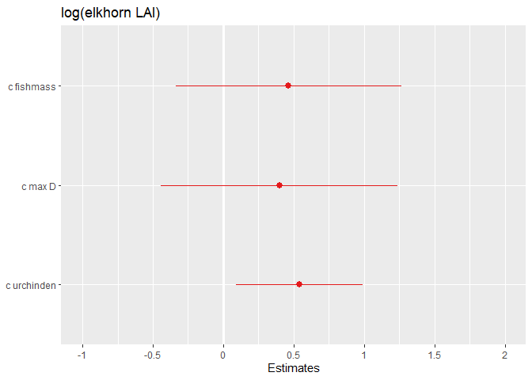
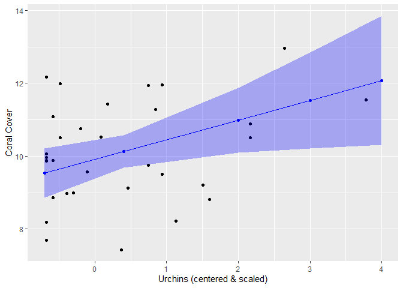

# What's in this document:
Some neat things I've learned about when handling mixed-effects models. The focus of these first few examples is how to *visualize* results of mixed-effects models.  

# Setup
Data = use the "mixedeff_herbivore.csv" file in the sample_data folder. This is a dataset used to explore the influences of herbivore populations on coral cover.  


```r
knitr::opts_chunk$set(echo = TRUE)

library(tidyverse) #for all data wrangling
library(cowplot) #for manuscript ready figures
library(lme4) #for lmer & glmer models
library(sjPlot) #for plotting lmer and glmer mods
library(sjmisc) 
library(effects)
library(sjstats) #use for r2 functions


me_data <- read_csv("C:/github/sample_code/sample_data/mixedeff_herbivore.csv")
```

# Create a basic mixed-effects model:
I'm not going to walk through the steps to building models (at least not yet), but rather just show an example of a model with coral cover as the response variable (elkhorn_LAI), herbivore populations & depth as fixed effects (c.urchinden, c.fishmass, c.maxD), and survey site as a random effect (site).  
.  
Note: due to the difference in scale of how the herbivore populations are measured, we are using the centered & scaled values- otherwise models won't converge. We are also use the log of the response variable. I am subsetting the data based on this specific study. Here we are only using data for when LAI_nonzero==1.

```r
#use the lme4 package

mod <- lme4::lmer(log(elkhorn_LAI) ~ c.urchinden + c.fishmass +c.maxD + (1|site), REML= FALSE, data= subset(me_data, LAI_nonzero ==1))
```

```
## boundary (singular) fit: see ?isSingular
```

```r
summary(mod)
```

```
## Linear mixed model fit by maximum likelihood  ['lmerMod']
## Formula: log(elkhorn_LAI) ~ c.urchinden + c.fishmass + c.maxD + (1 | site)
##    Data: subset(me_data, LAI_nonzero == 1)
## 
##      AIC      BIC   logLik deviance df.resid 
##    116.3    125.1    -52.1    104.3       26 
## 
## Scaled residuals: 
##     Min      1Q  Median      3Q     Max 
## -1.7501 -0.6725 -0.1219  0.6223  1.7882 
## 
## Random effects:
##  Groups   Name        Variance Std.Dev.
##  site     (Intercept) 0.000    0.000   
##  Residual             1.522    1.234   
## Number of obs: 32, groups:  site, 9
## 
## Fixed effects:
##             Estimate Std. Error t value
## (Intercept)  10.1272     0.2670  37.929
## c.urchinden   0.5414     0.2303   2.351
## c.fishmass    0.4624     0.4090   1.130
## c.maxD        0.3989     0.4286   0.931
## 
## Correlation of Fixed Effects:
##             (Intr) c.rchn c.fshm
## c.urchinden  0.036              
## c.fishmass  -0.193  0.020       
## c.maxD       0.511  0.491 -0.431
## convergence code: 0
## boundary (singular) fit: see ?isSingular
```

# Make a plot of the effect sizes:
This would definitely be useful if you have a lot of fixed effects!

## Unformatted plot of effect sizes

```r
sjPlot::plot_model(mod)
```

<!-- -->

## Formatted plot of effect sizes:
Let's change the axis labels & title. Type ?plot_model into your console to see details of ALL the features you can adjust.

```r
# Notes: axis labels should be in order from bottom to top. 
# To see the values of the effect size and p-value, set show.values and show.p= TRUE. Pvalues will only be shown if the effect size values are too

sjPlot::plot_model(mod, 
                   axis.labels=c("Urchin", "Depth", "Fish"),
                   show.values=TRUE, show.p=TRUE,
                   title="Effect of Herbivores on Coral Cover")
```

<!-- -->

# Table output of model results:
There's a neat feature of sjPlot that also creates nice tables of model summary outputs. This will give you the predictor variables included, their estimates, confidence intervals, p-values for estimates, and random effects information. Type ?tab_model in your console to see all the features you can adjust.

### Unformatted table

```r
sjPlot:: tab_model(mod)
```

```
## Warning: Can't compute random effect variances. Some variance components equal zero.
##   Solution: Respecify random structure!
```

<table style="border-collapse:collapse; border:none;">
<tr>
<th style="border-top: double; text-align:center; font-style:normal; font-weight:bold; padding:0.2cm;  text-align:left; ">&nbsp;</th>
<th colspan="3" style="border-top: double; text-align:center; font-style:normal; font-weight:bold; padding:0.2cm; ">log(elkhorn LAI)</th>
</tr>
<tr>
<td style=" text-align:center; border-bottom:1px solid; font-style:italic; font-weight:normal;  text-align:left; ">Predictors</td>
<td style=" text-align:center; border-bottom:1px solid; font-style:italic; font-weight:normal;  ">Estimates</td>
<td style=" text-align:center; border-bottom:1px solid; font-style:italic; font-weight:normal;  ">CI</td>
<td style=" text-align:center; border-bottom:1px solid; font-style:italic; font-weight:normal;  ">p</td>
</tr>
<tr>
<td style=" padding:0.2cm; text-align:left; vertical-align:top; text-align:left; ">(Intercept)</td>
<td style=" padding:0.2cm; text-align:left; vertical-align:top; text-align:center;  ">10.13</td>
<td style=" padding:0.2cm; text-align:left; vertical-align:top; text-align:center;  ">9.60&nbsp;&ndash;&nbsp;10.65</td>
<td style=" padding:0.2cm; text-align:left; vertical-align:top; text-align:center;  "><strong>&lt;0.001</td>
</tr>
<tr>
<td style=" padding:0.2cm; text-align:left; vertical-align:top; text-align:left; ">c urchinden</td>
<td style=" padding:0.2cm; text-align:left; vertical-align:top; text-align:center;  ">0.54</td>
<td style=" padding:0.2cm; text-align:left; vertical-align:top; text-align:center;  ">0.09&nbsp;&ndash;&nbsp;0.99</td>
<td style=" padding:0.2cm; text-align:left; vertical-align:top; text-align:center;  "><strong>0.019</strong></td>
</tr>
<tr>
<td style=" padding:0.2cm; text-align:left; vertical-align:top; text-align:left; ">c fishmass</td>
<td style=" padding:0.2cm; text-align:left; vertical-align:top; text-align:center;  ">0.46</td>
<td style=" padding:0.2cm; text-align:left; vertical-align:top; text-align:center;  ">-0.34&nbsp;&ndash;&nbsp;1.26</td>
<td style=" padding:0.2cm; text-align:left; vertical-align:top; text-align:center;  ">0.258</td>
</tr>
<tr>
<td style=" padding:0.2cm; text-align:left; vertical-align:top; text-align:left; ">c max D</td>
<td style=" padding:0.2cm; text-align:left; vertical-align:top; text-align:center;  ">0.40</td>
<td style=" padding:0.2cm; text-align:left; vertical-align:top; text-align:center;  ">-0.44&nbsp;&ndash;&nbsp;1.24</td>
<td style=" padding:0.2cm; text-align:left; vertical-align:top; text-align:center;  ">0.352</td>
</tr>
<tr>
<td colspan="4" style="font-weight:bold; text-align:left; padding-top:.8em;">Random Effects</td>
</tr>

<tr>
<td style=" padding:0.2cm; text-align:left; vertical-align:top; text-align:left; padding-top:0.1cm; padding-bottom:0.1cm;">&sigma;<sup>2</sup></td>
<td style=" padding:0.2cm; text-align:left; vertical-align:top; padding-top:0.1cm; padding-bottom:0.1cm; text-align:left;" colspan="3">1.52</td>

<tr>
<td style=" padding:0.2cm; text-align:left; vertical-align:top; text-align:left; padding-top:0.1cm; padding-bottom:0.1cm;">&tau;<sub>00</sub> <sub>site</sub></td>
<td style=" padding:0.2cm; text-align:left; vertical-align:top; padding-top:0.1cm; padding-bottom:0.1cm; text-align:left;" colspan="3">0.00</td>

<tr>
<td style=" padding:0.2cm; text-align:left; vertical-align:top; text-align:left; padding-top:0.1cm; padding-bottom:0.1cm;">N <sub>site</sub></td>
<td style=" padding:0.2cm; text-align:left; vertical-align:top; padding-top:0.1cm; padding-bottom:0.1cm; text-align:left;" colspan="3">9</td>
<tr>
<td style=" padding:0.2cm; text-align:left; vertical-align:top; text-align:left; padding-top:0.1cm; padding-bottom:0.1cm; border-top:1px solid;">Observations</td>
<td style=" padding:0.2cm; text-align:left; vertical-align:top; padding-top:0.1cm; padding-bottom:0.1cm; text-align:left; border-top:1px solid;" colspan="3">32</td>
</tr>
<tr>
<td style=" padding:0.2cm; text-align:left; vertical-align:top; text-align:left; padding-top:0.1cm; padding-bottom:0.1cm;">Marginal R<sup>2</sup> / Conditional R<sup>2</sup></td>
<td style=" padding:0.2cm; text-align:left; vertical-align:top; padding-top:0.1cm; padding-bottom:0.1cm; text-align:left;" colspan="3">0.180 / NA</td>
</tr>

</table>

### Formatted table

```r
# Notes: predictor labels (pred.labels) should be listed from top to bottom; dv.labels= the name of the response variable that will be at the top of the table.
sjPlot::tab_model(mod, 
                  show.re.var= TRUE, 
                  pred.labels =c("(Intercept)", "Urchins", "Fish", "Depth"),
                  dv.labels= "Effects of Herbivores on Coral Cover")
```

```
## Warning: Can't compute random effect variances. Some variance components equal zero.
##   Solution: Respecify random structure!
```

<table style="border-collapse:collapse; border:none;">
<tr>
<th style="border-top: double; text-align:center; font-style:normal; font-weight:bold; padding:0.2cm;  text-align:left; ">&nbsp;</th>
<th colspan="3" style="border-top: double; text-align:center; font-style:normal; font-weight:bold; padding:0.2cm; ">Effects of Herbivores on Coral Cover</th>
</tr>
<tr>
<td style=" text-align:center; border-bottom:1px solid; font-style:italic; font-weight:normal;  text-align:left; ">Predictors</td>
<td style=" text-align:center; border-bottom:1px solid; font-style:italic; font-weight:normal;  ">Estimates</td>
<td style=" text-align:center; border-bottom:1px solid; font-style:italic; font-weight:normal;  ">CI</td>
<td style=" text-align:center; border-bottom:1px solid; font-style:italic; font-weight:normal;  ">p</td>
</tr>
<tr>
<td style=" padding:0.2cm; text-align:left; vertical-align:top; text-align:left; ">(Intercept)</td>
<td style=" padding:0.2cm; text-align:left; vertical-align:top; text-align:center;  ">10.13</td>
<td style=" padding:0.2cm; text-align:left; vertical-align:top; text-align:center;  ">9.60&nbsp;&ndash;&nbsp;10.65</td>
<td style=" padding:0.2cm; text-align:left; vertical-align:top; text-align:center;  "><strong>&lt;0.001</td>
</tr>
<tr>
<td style=" padding:0.2cm; text-align:left; vertical-align:top; text-align:left; ">Urchins</td>
<td style=" padding:0.2cm; text-align:left; vertical-align:top; text-align:center;  ">0.54</td>
<td style=" padding:0.2cm; text-align:left; vertical-align:top; text-align:center;  ">0.09&nbsp;&ndash;&nbsp;0.99</td>
<td style=" padding:0.2cm; text-align:left; vertical-align:top; text-align:center;  "><strong>0.019</strong></td>
</tr>
<tr>
<td style=" padding:0.2cm; text-align:left; vertical-align:top; text-align:left; ">Fish</td>
<td style=" padding:0.2cm; text-align:left; vertical-align:top; text-align:center;  ">0.46</td>
<td style=" padding:0.2cm; text-align:left; vertical-align:top; text-align:center;  ">-0.34&nbsp;&ndash;&nbsp;1.26</td>
<td style=" padding:0.2cm; text-align:left; vertical-align:top; text-align:center;  ">0.258</td>
</tr>
<tr>
<td style=" padding:0.2cm; text-align:left; vertical-align:top; text-align:left; ">Depth</td>
<td style=" padding:0.2cm; text-align:left; vertical-align:top; text-align:center;  ">0.40</td>
<td style=" padding:0.2cm; text-align:left; vertical-align:top; text-align:center;  ">-0.44&nbsp;&ndash;&nbsp;1.24</td>
<td style=" padding:0.2cm; text-align:left; vertical-align:top; text-align:center;  ">0.352</td>
</tr>
<tr>
<td colspan="4" style="font-weight:bold; text-align:left; padding-top:.8em;">Random Effects</td>
</tr>

<tr>
<td style=" padding:0.2cm; text-align:left; vertical-align:top; text-align:left; padding-top:0.1cm; padding-bottom:0.1cm;">&sigma;<sup>2</sup></td>
<td style=" padding:0.2cm; text-align:left; vertical-align:top; padding-top:0.1cm; padding-bottom:0.1cm; text-align:left;" colspan="3">1.52</td>

<tr>
<td style=" padding:0.2cm; text-align:left; vertical-align:top; text-align:left; padding-top:0.1cm; padding-bottom:0.1cm;">&tau;<sub>00</sub> <sub>site</sub></td>
<td style=" padding:0.2cm; text-align:left; vertical-align:top; padding-top:0.1cm; padding-bottom:0.1cm; text-align:left;" colspan="3">0.00</td>

<tr>
<td style=" padding:0.2cm; text-align:left; vertical-align:top; text-align:left; padding-top:0.1cm; padding-bottom:0.1cm;">N <sub>site</sub></td>
<td style=" padding:0.2cm; text-align:left; vertical-align:top; padding-top:0.1cm; padding-bottom:0.1cm; text-align:left;" colspan="3">9</td>
<tr>
<td style=" padding:0.2cm; text-align:left; vertical-align:top; text-align:left; padding-top:0.1cm; padding-bottom:0.1cm; border-top:1px solid;">Observations</td>
<td style=" padding:0.2cm; text-align:left; vertical-align:top; padding-top:0.1cm; padding-bottom:0.1cm; text-align:left; border-top:1px solid;" colspan="3">32</td>
</tr>
<tr>
<td style=" padding:0.2cm; text-align:left; vertical-align:top; text-align:left; padding-top:0.1cm; padding-bottom:0.1cm;">Marginal R<sup>2</sup> / Conditional R<sup>2</sup></td>
<td style=" padding:0.2cm; text-align:left; vertical-align:top; padding-top:0.1cm; padding-bottom:0.1cm; text-align:left;" colspan="3">0.180 / NA</td>
</tr>

</table>

# Plot model estimates WITH data
Using the 'effects' and 'ggplot2' packages, we can plot the model estimates on top of the actual data! We do this for one variable at a time. Note: the urchin data was scaled & centered for use in the model, so we are plotting the scaled and centered data values NOT the raw data (ie urchin density) 

### Step 1: Save the effect size estimates into a data.frame

```r
# Use the effects package --> effect function. term= the fixed effect you want to get data on, mod= name of your model.

effects_urchin <- effects::effect(term= "c.urchinden", mod= mod)
summary(effects_urchin) #output of what the values are
```

```
## 
##  c.urchinden effect
## c.urchinden
##     -0.7      0.4        2        3        4 
##  9.53159 10.12715 10.99342 11.53484 12.07626 
## 
##  Lower 95 Percent Confidence Limits
## c.urchinden
##      -0.7       0.4         2         3         4 
##  8.857169  9.680160 10.104459 10.216537 10.306881 
## 
##  Upper 95 Percent Confidence Limits
## c.urchinden
##     -0.7      0.4        2        3        4 
## 10.20601 10.57414 11.88238 12.85314 13.84563
```

```r
# Save the effects values as a df:
x_urch <- as.data.frame(effects_urchin)
```

### Step 2: Use the effects value df (created above) to plot the estimates
You can break this up into separate steps if you wish to save a base plot (of your fixed effect & response var data only). Note: for the plot, I am subsetting the data based on this specific study. Here we are only using data for when LAI_nonzero==1.

```r
#Basic steps:
  #1 Create empty plot

  #2 Add geom_points() from the DATA: urchin data on the x axis (independent va= c.urchinden) and coral data on the y-axis (response var= elkhorn_LAI)

  #3 Add geom_point for the MODEL estimates (data= x_urchi here, this is the dataset you created in the above chunk). We will change the color so they are distinguishable from the data

  #4 Add geom_line for the MODEL estimates. Change the color to match the estimate points (ie whatever color you chose for step3)

  #5 Add geom_ribbon that has the CI limits for the model estimates

  #6 Edit the labels as you see fit!

#1
urchin_plot <- ggplot() + 
  #2
geom_point(data=subset(me_data, LAI_nonzero==1), aes(c.urchinden, log(elkhorn_LAI))) + 
  #3
  geom_point(data=x_urch, aes(x=c.urchinden, y=fit), color="blue") +
  #4
  geom_line(data=x_urch, aes(x=c.urchinden, y=fit), color="blue") +
  #5
  geom_ribbon(data= x_urch, aes(x=c.urchinden, ymin=lower, ymax=upper), alpha= 0.3, fill="blue") +
  #6
  labs(x="Urchins (centered & scaled)", y="Coral Cover")

urchin_plot
```

<!-- -->

